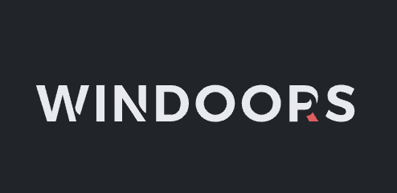
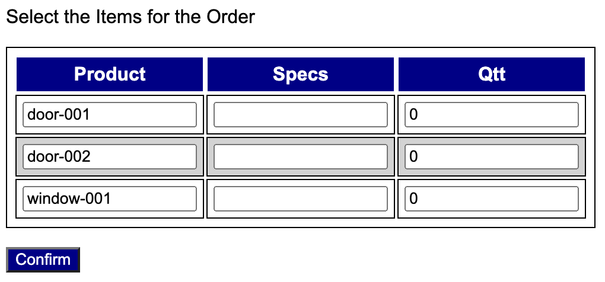

[](https://classroom.github.com/a/tvudxptQ)
# Overview

**Windoors** is a small company that builds windows and doors that can be ordered by pre-registered resellers. The company wants to simplify the process by which resellers enter new purchase orders. Your team has been hired to implement a web app that meets the requirements described in this document.

Considering that the requirements for the **Windoors** web app are well understood and that the size of the project is relatively small, it was determined that the **waterfall** process model will be used in the development of this system. Each phase of the project is described in more detail next. 


Windoors Logo

# Communication Phase

## Overview

The project is to build a web app that allows Windoors's resellers to place new orders for doors and windows. The web app will simplify how orders are placed and, consequentially, increase the company's revenue. 

## Objectives 

* Simplify how orders are placed.
* Manage and track orders.
* Maintain the products catalog.

## Features 

1. Users (resellers and admin) must be able to authenticate themselves. 
2. Resselers must be able to place new orders through the platform.
3. Resselers must be able to track their own orders. 
4. Admin users must be able to change the status of any order. 
5. Admin users should be able to update the products catalog. 

## Contraints 

* A working version with all required functionalities (the ones specified with a **must**) is expected to be delivered in 2 weeks. 
* The implementation team must have from 3 to 5 members. 
* The software must be implemented in **Python** and based on **Flask** and **SQLAlchemy**. 
* **SQLite** can be chosen as the database. 

## Risks 

* The tight schedule may result in the system not meeting quality requirements. 

## Assumptions 

* **Windoors** will provide the current products catalog for the initial database load. 
* **Windoors** will also provide a list of admin users for the initial database load. 

# Planning Phase

## Schedule 

Estimate a schedule for this project by completing the table below. 

|Phase|Task|Start|End|Duration|Deliverable|
|---|---|---|---|---|---|
|Modeling|Requirements Analysis|09/28/23|09/30/23|2 days|Use Case Diagram|
|Modeling|Data Model|09/30/23|10/01/23|2 days|Class Diagram|
|Construction|Coding|10/01/23|10/07/23|7 days|Code|
|Construction|Testing|10/04/23|10/07/23|3 days|Test Report|
|Deployment|Delivery|10/07/23|10/08/23|2 days|Final Commit/Push|

## Team Roles

Assign roles for each member of the team by completing the table below. 

|Name|Role(s)|
|--|--|
|name|manager,developer,tester,documenter|
|Simao|manager,developer|
|Rye|developer,documenter|
|Parker|developer,tester|

# Modeling Phase

## Requirements Analysis 

Based on the description given for this project, complete the requirements analysis by building a use case diagram using UML.  

## Data Model 

Based on the description given for this project, complete the data modeling by building a class diagram using UML. At a minimum, your data model should contemplate the following entities (with the listed attributes):

* User: email, password, creation date. 
* Reseller User: company, address, phone, website. 
* Admin User: name, title
* Product: code, description, type (window or door), available (true/false), price
* Order: number, creation date, items, status (new, accepted, delivered, completed)
* Item: order number, sequential number, product code, quantity, and specs (width, height, etc)

## Baseline Implementation

Create a baseline for your application in **Flask** so that it is possible for users to authenticate and navigate through all pages, but using fake (hard-coded) data. This will allow the page design to be done before the actual implementation. 

# Implementation Phase

**STOP!** Do not start the implementation before presenting what you have done so far to your instructor. This is a required check-point of your project. 

# Testing Phase

At this point you are not expected to write automated tests.  Instead, you are asked to run manual tests and complete a report using the table below. 

|Functionality Tested|Date|Time|Result|Tester|
|--|--|--|--|
|Sign-In|10/07/23|3:51|passed|Simao|
|Sign-Out|10/07/23|3:52|passed|Simao|
|View Catalog|10/07/23|3:53|passed|Simao|
|Place Order|10/07/23|3:54|passed|Simao|
|View Order Status|10/07/23|3:55|passed|Simao|
|Change Order Status|10/07/23|3:56|passed|Simao|
|Update Product Catalog|10/08/23|1:24|passed|Simao|
|Everything|10/08/23|2:00|passed|Simao|

# Deployment Phase

Commit and push your project using "final submission" as the commit message. 

In addition, each student will receive a form to evaluate the members of their team and to self-evaluate themselves.  

# Rubric 

+5 Planning: Schedule

+5 Planning: Team Roles 

+15 Modeling: Use Case Diagram 

+15 Modeling: Class Diagram

+10 Check-point

+40 Implementation

+10 Testing 

-25 Team/Self Evaluation

## Bonus

+5 the products catalog shows an image for each product

+10 admin users can update the products catalog (add new products and change the availability of a product or its price)

# Miscelaneous 

To facilitate grading, please add the following admin user: { 'id'='tmota', 'passwd'='1' }.

Also, add the following products: [{ 'code='door-001' }, { 'code='door-002' }, { 'code='window-001' } ].

When I implemented my solution, I thought using Flask WTF's **FieldList** and **FormField** useful when building the form to place orders. **FieldList** allowed me to create a form with repetitive input fields, as depicted below. 




# UML Files

## Use Case Diagram

```
@startuml

top to bottom direction

:ReSellers: as R
:Administrator: as A

package "Windoors" {

(sign in)
(sign out)

(place order)
(update product catalog)
(change status of order)
(view catalog)
(view order status)

}
R -->(sign in)
A --> (sign in)
A --> (view catalog)
A --> (update product catalog)
R --> (place order)
A --> (change status of order)
R --> (view catalog)
R --> (view order status)
A --> (sign out)
R --> (sign out)

@enduml

```

## Class Diagram

```
@startuml

class User {
  - email: String
  - password: String
  - creationDate: Date
}

class ResellerUser {
  - company: String
  - address: String
  - phone: String
  - website: String
}

class AdminUser {
  - name: String
  - title: String
}

class Product {
  - code: String
  - description: String
  - type: String
  - available: boolean
  - price: double
  - image: String
}

class Order {
  - number: String
  - creationDate: Date
  - status: String
}

class Item {
  - orderNumber: String
  - sequentialNumber: int
  - productCode: String
  - quantity: int
  - specs: String
}

User <|-- ResellerUser
User <|-- AdminUser
Order "1" *-> "n" Item : items
Order "n" <-- "1" ResellerUser : orders
Item "1" o--> "1" Product : product

@enduml
```

